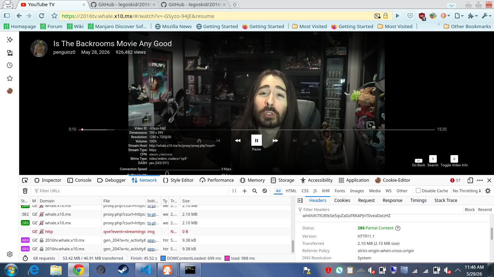
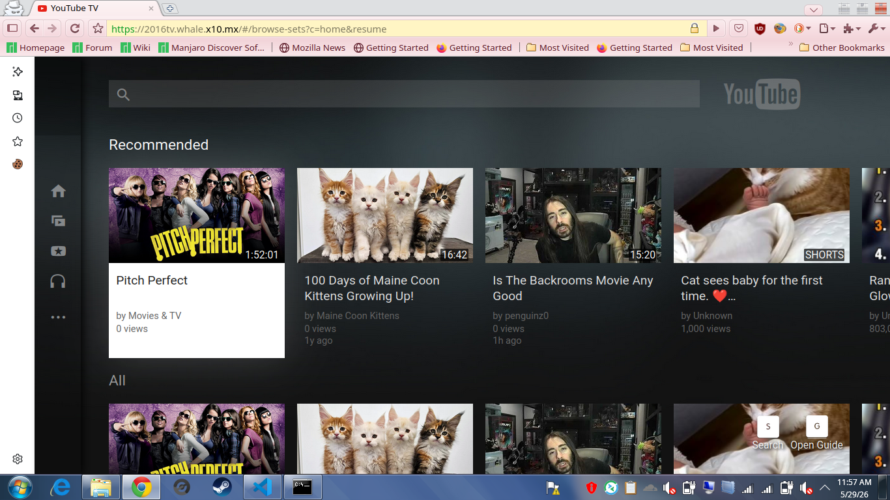

# 2016tv (v2)

Another attempt at reviving the old 2015-2016 YouTubeTV HTML5 Web App!

Project forked from [halohash/2016tv](https://github.com/halohash/2016tv) which is a fork of [erievs/2016YouTubeTV](https://github.com/erievs/2016YouTubeTV) (which is now archived). (I had to detach this fork from the original repo)

Also, Ponymouse, I don't know who you are or how you starred my repo when I haven't even announced it anywhere yet, but thanks for the star!

## Goals
* To create a standalone version of 2016YouTubeTV with a custom PHP-based InnerTube backend (replacing the old NodeJS backend), allowing it to run on any web server without complex setup, or on static hosting like GitHub Pages, letting you watch on the go! See [YouTubeTV-RapidAPI-PHP](https://github.com/legoskid/YouTubeTV-RapidAPI-PHP) for backend details.
* To make it run on real TVs using Cobalt, the app this was designed for and what YouTube TV on Android TVs still run on.
* To make it so that you can switch between YouTube TV versions, for real this time. Due to the nature of this codebase, that's going to be pretty hard to do
* Support user-agents/browsers other than Chrome because the code defaults to some weird CSS. (Already done lol)

## Screenshots

## Before Posting An Issue!

Sike, put any issue and I'll try to help you out

## Setup
**Website is already up and running: https://2016tv.whale.x10.mx**

Same as the OG
>[Make sure you have nodejs, npm, and python3 (version 3.7.something or above!)]
>
>- Step 1: run "git clone https://github.com/legoskid/2016tv"
>
>- Step 2: run "npm install"
>
>- Step 3: if you run into issues with youtube-exec, try running >"npm install youtube-dl-exec --save"
>
>- Step 4: if you want to set a custom server adress, such as your local ip adress, run 2016youtubesetup.js (it is in the root of the project), it'll display it for you.
>
>- Step 5: run npm start, and you're done!
>
>[To update just run "git fetch origin master"]

Now hold up, there are two ways to run this.
1. You can run the backend and frontend together, which is what the original did. To do this, just run `npm start` and it'll start both the backend and frontend at the same time. Make sure you go to YouTube TV, go to the settings, scroll all the way to "Open ClientSide Settings" and set the InnerTube URL to whatever your local IP address is with port 8090, and the proxy URL with port 8070
2. (Recommended) Host the 2016tv folder, GitHub Pages or any static hosting should work fine

## Setup (Cobalt)
I'll also fill this in later

# View the original README [here](README_old.md)